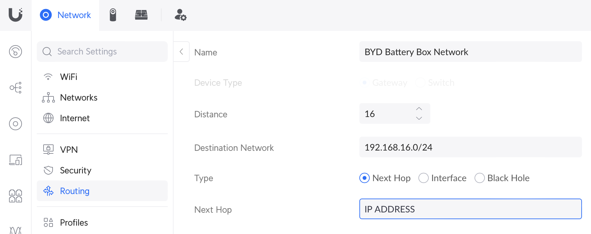
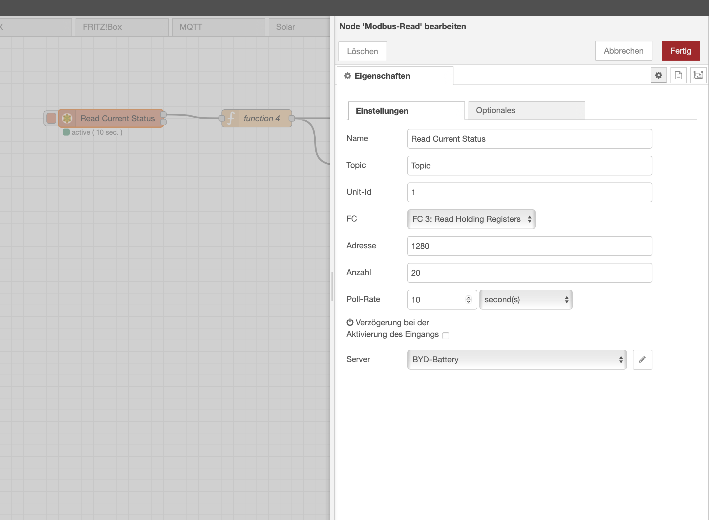
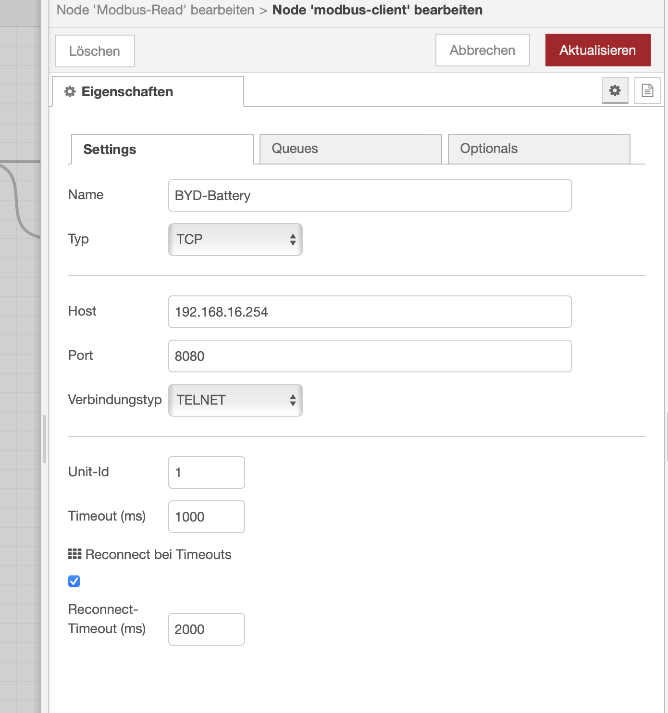
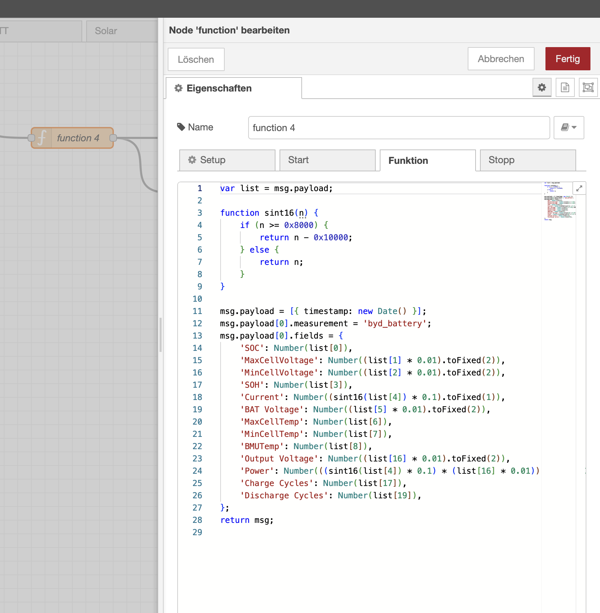

# BYD-Battery-Box Infos

Infos about the BYD-Batteries for solar installations

## Networking connection

The BYD-Battery-Box has an Ethernet and Wifi-connection, the latter is turned off automatically after some time and only used for configuration via the BE Connect Plus app. The login to the IP address via DHCP is protected via a username and password, which for my system i do not have and were not able to figure out. This allows access to the configuration of the Wifi/Networking modul. Because the BE Connect Plus app for Windows requires this IP address to be fixed, it is not a good idea to change anything there – even if access is possible.

The box uses a fixed manual IP address for communication via Etherner `192.168.16.254`. The first step is to gain access this IP address in a home network setup.

If configured correctly as explained below, the Windows software BE Connect Plus will detect the box and work correctly.

### FRITZ!Box

Find out the IP address of the configuration website. Because the box uses DHCP to get the address, you should easily find it under "Netzwerk => Netzwerkverbindungen" in the FRITZ!Box admin settings. Make sure the IP address is set to "fixed", so it never changes.

Next step is to setup a static routing via "Statische IPv4-Routing-Tabelle". It should be "Aktiv", the "Netzwerk" has to be "192.168.16.0" with a "Subnetzmaske" of "255.255.255.0" and the Gateway will be the IP address, which we found out above.

### Ubiquiti Networks

Select "Network" => "Client Devices", find the Box and select the line. Selet "Settings" and check "Fixed IP Address". Copy the IP Address, which is listed right below that setting.

Select "Network" => "Settings" (the gear menu on the bottom of all options on the left). Now select "Routing" => "Static Routes" and create a new entry. The "Destination Network" has to be "192.168.16.0/24", "Type" should be "Next Hop" and "Next Hop" is the IP address from above. The Name can be anything, it is just for you.




## Passwords for the Windows BE Connect Plus application

The passwords for the application can be found in the `Config.ini` file, which is next to the executable. I've written a [little Python script to decode the passwords](./Decode_Passwords.py), there is no real encryption, it is just base64 encoded and all ascii values have a fixed offset of -66.

|         Username |    Password |
| ---------------- | ----------- |
|        Installer | BYDB-Box    |
|  Service Partner | BYDT1@s0    |
| Inverter Partner | BoxT@2P1    |
|            Admin | CN#2021$wdy |

The Installer account is the one that should be used. Partner accounts seem to use different update servers, which I would not mess with and the Admin account has some internal options, which I also would not mess with.

## Communication with the BYD-Battery-Box

It is possible to read and write configurations in the box. This is done via a variation of Modbus RTU, not Modbus TCP. It works like a serial port version of Modbus, except all communication goes via `192.168.16.254` and port `8080`. The Unit ID for the box is `1`. Here is an example to read the first 102 registers via Python.

```python
import pymodbus
from pymodbus.client.tcp import ModbusTcpClient as ModbusClient
from pymodbus.transaction import ModbusRtuFramer as ModbusFramer

client = ModbusClient(host='192.168.16.254', port=8080, framer=ModbusFramer)
client.connect()
result = client.read_holding_registers(0x0000,0x66, slave=1)
print(result.registers)
client.close()
```

Out of the 16-bit register address spaces on the following ones are readable without error:

| Start-Reg | End-Reg | Function |
| --------- | ------- | -------- |
| 0x0000	| 0x0066  | Hardware info and configuration |
| 0x0100	| 0x01ff  | unknown |
| 0x0400	| 0x0408  | unknown |
| 0x0500	| 0x0518  | Current status |
| 0x0550	| 0x0557  | BMS info |
| 0x05a0	| 0x05a7  | Read BMU/BMS history |
| 0x05f0	| 0x0639  | unknown – probably update related |
| 0x0640	| 0x0689  | unknown |

I do not document all registers here, but instead ask you to look at the [provided Python code](./Read_Modbus.py) to find the information you need.

As you can see from the code, the serial number of the unit defines the type and which batteries are supported for that type.

The registers 0x0010…0x0012 contain the configuration of the hardware. You should not change it, because it might damage your hardware.

`BMU A` and `BMU B` seem to be two versions of the firmware. During an update the working area one is overwritten. Once successful, the working area is then switched to the other one.

BMS info and the BMS/BMU history area read by first writing a request and the status code. Then waiting for the status response and then reading 65 register five times. The first register contains the size of the package. See the python code for more details.

## Accessing the BYD-Battery-Box via NodeRed

First make sure `node-red-contrib-modbus` is installed. Then add the nodes and configure as seen in the screenshots. I feed the output into an InfluxDB, but that is up to you to decide what to do with the results.





***Important*** only one application can access the box at the same time. If you have a NodeRed script running, then the windows application will fail!


## Firmware versions

While I will not document firmware updates, because it could change at any time and it is too risky to deal with, I'll provide a code block to read all available firmware versions from they BYD server.

```python
#!/usr/bin/env python3

import pprint
import requests

pp = pprint.PrettyPrinter(depth=6)

r = requests.post('https://deapp.byd.com/api/V1/Http2/GetFileNewLink', json={"SoftVersion": "V1.0"})
print(r.status_code)
pp.pprint(r.json())
```

